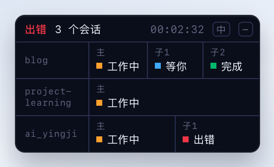
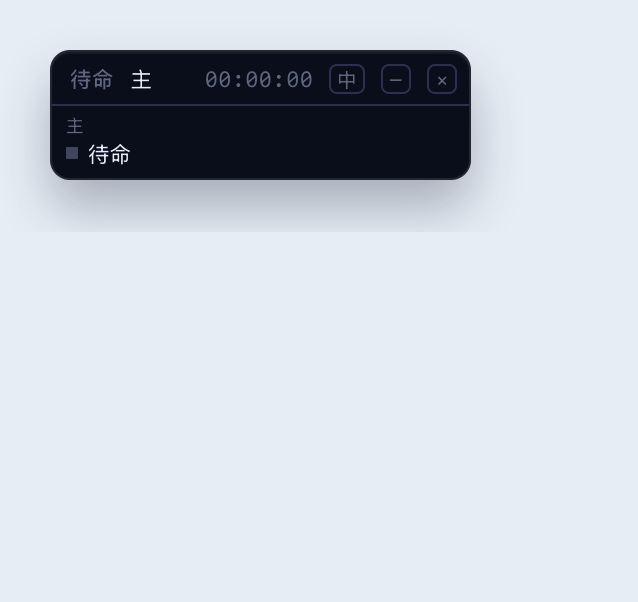
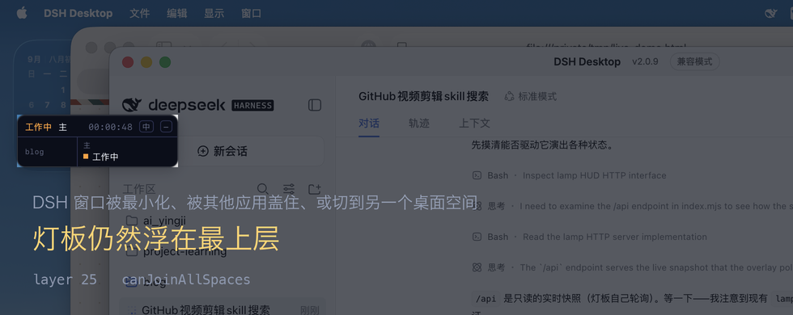

# xy-dsh

[](./LICENSE)
[](./xy-dsh-lamp)
[](#装)
[](./COMPATIBILITY.md)
[](https://github.com/awesome-dsh-plugin/awesome-dsh-plugin)
[](https://github.com/Xinyuan-Gao/xy-dsh/stargazers)

[DeepSeek Harness](https://github.com/deepseek-ai/deepseek-harness) 插件集合。

*Plugins for DeepSeek Harness — an always-on-top agent lamp board for macOS, plus a context lens.*

<p align="center"></p>

## 插件

| 插件 | 做什么 | 状态 |
|---|---|---|
| **[xy-dsh-lamp](./xy-dsh-lamp)** | macOS 置顶灯板，一个 Agent 一盏灯 | 日常在用 |
| [xy-dsh-context](./xy-dsh-context) | 输入区上方的 Context Lens | 原型 |

**灯板**：置顶浮窗（不占 DSH 位置）、一 Agent 一灯、多会话分行、收起成一排小灯、五种背景、中英切换、拖动与位置记忆、审批与提问时蓝灯闪烁、根 Agent 结束发系统通知。

**Context Lens**：显示 Turns / Steps / Cache hit / Output，挂在输入区上方、会话标题栏和侧栏三处。

## 装

灯板（macOS）：

```bash
dsh plugin --profile desktop add "github:Xinyuan-Gao/xy-dsh#path:xy-dsh-lamp"
```

Context Lens：

```bash
dsh plugin --profile web add "github:Xinyuan-Gao/xy-dsh#path:xy-dsh-context"
```

装完重启 DSH Desktop，或重启 `dsh web`。要更新就重跑同一条命令。

**前置条件**：Node ≥ 22.19.0。灯板只在 macOS 上有窗口，且第一次加载需要 Xcode Command Line Tools——宿主会用 `swiftc` 把 `hud.swift` 编到 `~/.dsh/xy-dsh-lamp-hud.app`。没有 `swiftc` 时灯板不出现，通知部分照常工作。

想改代码就 clone 下来、用 `link:` 装一份可编辑的：

```bash
git clone https://github.com/Xinyuan-Gao/xy-dsh.git
cd xy-dsh
dsh plugin --profile desktop add link:"$PWD/xy-dsh-lamp"
```

> `dsh plugin add` 是把参数原样透传给 profile 目录里的 `pnpm add`，所以 pnpm 的 `#path:` 片段可以直接指定仓库里的子目录。

## 灯板

<p align="center"></p>

它浮在**所有窗口之上**，不占 DSH 的位置。这张是真实桌面截图，底下的 DSH 窗口被盖住了，灯板亮度不变：

<p align="center"></p>

一盏灯一个 Agent，一个会话一行；点 `−` 收起成一排小灯（一个任务一盏），点 `×` 退出，右键出菜单换背景。**有审批或提问卡在你这的时候那盏灯转蓝闪烁**——这是它最有用的一格。

功能、配置、以及每个实现选择背后的实测依据，都在 [xy-dsh-lamp/README.md](./xy-dsh-lamp/README.md)。

## 兼容性

两个插件都在各自的 `package.json` 里逐版本声明与 `@deepseek-ai/dsh` 的兼容性（`dsh.compatibility.dshReleases`），并配了可复现的证据脚本：每个官方 release 在一次性 `DSH_HOME` 里跑 install → compose → uninstall。

当前声明与验证结果见 **[COMPATIBILITY.md](./COMPATIBILITY.md)**。

## 测试

```bash
./test/run.sh
```

四套、共 60 条断言：宿主逻辑（Node，任何平台）、HUD 进程生命周期（macOS）、页面渲染与交互、收起态与背景（后两套要 playwright）。

每套都在自己的临时 HOME 里跑，不会碰你真实的 `~/.dsh`。细节和「每条断言对应哪个真实问题」见 [test/README.md](./test/README.md)。

## License

MIT

<details>
<summary>README 里的图片是怎么来的</summary>

没有一张是手画的，也没有一张是录屏——都是 `docs/` 里两个脚本用**真实浏览器引擎**渲染真实的 `overlay.html` 生成的，在受控背景前跑，所以不会带上桌面上的任何东西。

- `docs/make-intro.py` 把灯板按状态序列逐步驱动，以固定帧率连续录成 GIF（含「等你」态的闪烁、收起态与中英切换）
- `docs/make-assets.py` 出那几张静态 PNG（多会话、中英对照、五种背景）

想重新出图就跑对应脚本。

</details>
