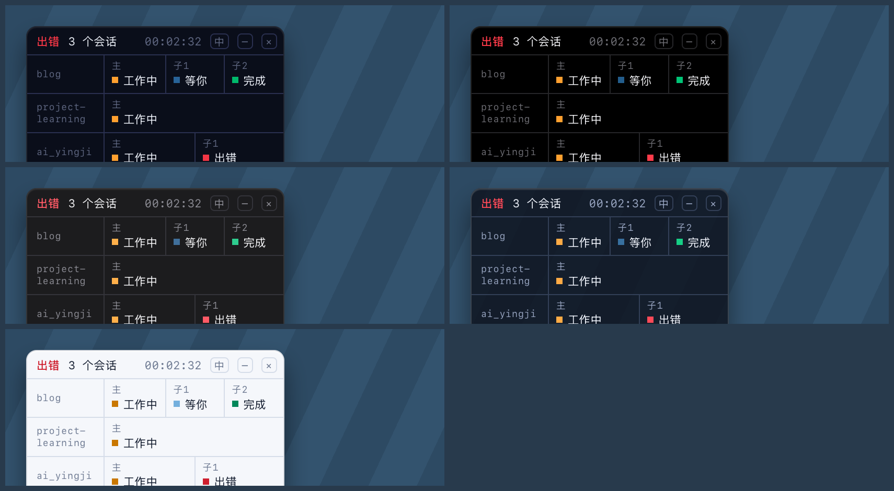

# xy-dsh-lamp

[](../LICENSE)
[](#装)
[](#装)
[](../COMPATIBILITY.md)
[](https://github.com/awesome-dsh-plugin/awesome-dsh-plugin)

**系统级置顶灯板。** 每个 Agent 一盏灯，全绿后收成一行 `完成 04/04`。

它是一条浮在**所有 App、所有工作台之上**的独立窗口，不嵌在 DSH 里，也不占 DSH 的位置——你可以把 DSH 最小化、切到别的应用、换一个桌面空间，灯板留在原处，一眼就能看出后台还有没有活在跑。

根 Agent 结束时发系统通知。DSH 退出后灯板自己关掉。

<p align="center"></p>

## 装

macOS，需要 Node ≥ 22.19.0：

```bash
dsh plugin --profile desktop add "github:Xinyuan-Gao/xy-dsh#path:xy-dsh-lamp"
```

装完重启 DSH Desktop。要更新就重跑同一条命令。

第一次加载时宿主会用 `swiftc` 把 `hud.swift` 编到 `~/.dsh/xy-dsh-lamp-hud.app`，所以**机器上要有 Xcode Command Line Tools**（`xcode-select --install`）。没有 `swiftc` 时灯板不出现，插件的系统通知部分照常工作。

想改代码就 clone 下来用 `link:` 装一份可编辑的：

```bash
git clone https://github.com/Xinyuan-Gao/xy-dsh.git
cd xy-dsh
dsh plugin --profile desktop add link:"$PWD/xy-dsh-lamp"
```

改了 `hud.swift` 之后重启 DSH，`compileHud` 会比较 mtime 自动重编。

## 状态与灯色

| 灯 | 状态 | 含义 |
|---|---|---|
| 灰 | 待命 | 没有在跑的东西 |
| 琥珀 | 工作中 | 正在跑 |
| **蓝闪** | **等你** | 有审批待处理，或者提问问出去了还没答 |
| 红 | 出错 | 那个 Agent 失败了 |
| 绿 | 完成 | 跑完了 |

**等你用的是蓝色，不是琥珀。** 这两个状态原来同色、只靠闪不闪区分，扫一眼分不出来——现在色相就不同。

一盏灯出错时，标题栏的 `工作中 / 等你` 会变成红色的 `出错`，但其余灯照常显示各自的进度。

## 多个会话

<p align="center"></p>

**一个会话一行。** 并行开几个项目时，每个有主 Agent 在跑的会话各占一行，左列是项目名（取会话工作目录的最后一段），右边是该会话的灯。项目名太长会折行，鼠标悬停显示完整名字和会话标题。

表头在有多个会话时把 Agent 代号换成 `N 个会话`。最多画 6 行，多出来的在表头补 `+N`，不会静默吞掉。行序按紧急程度排：出错 → 等你 → 工作中 → 已完成。

表头那个时钟是**最早还在跑的那个 Agent 已经跑了多久**，不是某一个会话的用时。

## 收起与退出

标题栏右侧有四个控件：`中` / `EN` 切语言，`−` 收起，`×` 退出。

**`−` 收起成一排小灯：一个任务一盏灯**，颜色就是那个任务自己的汇总状态。三个任务并行时就是三盏，可能同时是蓝、红、琥珀。顺序跟展开时的行序一致。

鼠标悬停显示 `状态 用时 · 各会话名字与标题`（多会话时全都列出来）。点这个小方块展开，拖它则只移位。收起状态会记住，重启后还是收起的。

**`×` 退出要点两次**：第一次变成红色的 `确认`，3 秒内再点一次才真退出。退出后要重启 DSH 才会回来，所以加了这道确认。

**右键**也出菜单：`回到左上角` / `背景` / `退出灯板`。窗口正好只有卡片那么大，页面内的弹出层没地方画，所以菜单是宿主弹的原生菜单。

## 背景

**右键 → 背景**，五种可选，当前的那项带勾：

| | |
|---|---|
| 深蓝 | 默认 |
| 纯黑 | 纯 `#000`，适合 OLED 或者不想看见边框 |
| 石墨 | macOS 深灰，跟系统窗口更贴 |
| 半透明 | 卡片半透明，桌面透出来（不是真毛玻璃，那要 `NSVisualEffectView`） |
| 浅色 | 浅底深字，灯色也换成加深版本，否则琥珀在浅底上读不清 |

<p align="center"></p>

选择跟位置、收起态存在同一个文件里（`~/.dsh/xy-dsh-lamp-window.json`），重启后还在。背景在**页面脚本运行之前**注入，所以启动第一帧就是选中的那张，不会先闪一下默认色。

## 语言

**默认中文**，标题栏 `中` / `EN` 一点就换。

| 状态 | 中文 | English |
|---|---|---|
| 待命 | 待命 | IDLE |
| 工作中 | 工作中 | RUN |
| 等你 | 等你 | ASK |
| 出错 | 出错 | ERR |
| 完成 | 完成 | DONE（灯格里是 OK） |

Agent 代号在中文下也跟着变：`ROOT` → `主`，`A1` / `A2` → `子1` / `子2`。这只是显示，宿主内部仍然用 `ROOT` / `A1`。

同一块灯板，两种语言（上图中文、下图 English）：

<p align="center"></p>

选择写到 `~/.dsh/xy-dsh-lamp.json`，重启 DSH 后仍然生效。首次安装的默认值由配置里的 `lang` 决定，一旦用按钮切过，按钮的选择优先。

> 改 `index.mjs` 这类**宿主代码**要重启 DSH 才会加载；只改 `overlay.html` 这类页面不用。

## 拖动与位置

**整块灯板都能拖**（鼠标是抓手），标题栏那四个按钮除外。位置会记住，重启 DSH 后回到原处；记下的位置如果落在已断开的显示器上，会自动退回左上角。

## 配置

`~/.dsh/profiles/<profile>/cordis.patch.yml`：

```yaml
- id: xy-dsh-lamp
  name: xy-dsh-lamp
  config:
    enabled: true
    notify: true      # 根 Agent 结束时发系统通知
    sound: true       # 通知带声音
    lang: zh          # zh | en，只决定首次安装的默认语言
    forgetMs: 600000  # 已完成会话在内存里保留多久（下限 180000）
```

---

# 实现笔记

下面是给改代码的人看的：几个地方的写法是被实测逼出来的，不是随手选的。

## 窗口尺寸（WKWebView 里实测）

窗口是**透明圆角窗**，尺寸跟着内容走：页面量出自己的自然尺寸后回报给 HUD，窗口按这个尺寸调整，**左上角固定不动**。

| 状态 | 尺寸（中文 / 英文） |
|---|---|
| 待命（无 Agent） | 188×65 / 213×65 |
| 1 个 Agent | 199×65 / 206×65 |
| 满 6 个 Agent | 344×65 / 338×65 |
| 2 个会话 | 233×107 |
| 3 个会话 | 222×146 |
| 全部完成 | 211×29 / 219×29（收成一行 `完成 02/02`） |
| 收起（1 个任务） | 30×30 |
| 收起（3 / 6 个任务） | 46×30 / 82×30 |

中文字宽，所以 6 灯时比英文略宽一点。

## 拖拽为什么是自己实现的

AppKit 自带的拖拽（`performDrag`、`isMovableByWindowBackground`）对「无边框 + 透明」窗口**完全不生效**——四种组合都实测过，一律直接返回，窗口一个像素都不动。

而这个 WKWebView 的 `window.screenX` / `screenY` 返回的是垃圾值（实测 `0` / 屏幕高度），页面也报不出屏幕坐标。

所以拖动是这样做的：页面只负责在 `pointerdown / pointermove / pointerup` 时报「指针动了」，宿主用 `NSEvent.mouseLocation` 读真实光标位置，**按增量**搬窗口。增量逐次累加，所以拖动中途窗口尺寸变化（agent 数量变了、或收起态展开）也不会错位。

「点击」还是「拖动」由宿主判定：整段手势位移小于 4pt 算点击。收起态的小灯被点击就展开，被拖动就只移位、不展开。

## 「等你」怎么判定

琥珀→蓝闪表示**有东西卡在你这里**，两个来源：

- **审批** —— 听 `approval/asked` 和 `approval/decided` 两个 session 事件。
- **提问** —— `ask_user_question` 走的是 `user-questions/request` waterfall 钩子而不是审计事件，所以改成看那个**待处理的 `tool/call`**（名字正好是 `ask_user_question`），用 `callId` 和 `tool/result` 配对。其他工具调用不会误判。

**不能用 `turn/end` 判断**：审批期间 turn 是**开着的**（`approval.request()` 要求 turn 未结束），agent 状态一路都是 `running`，`turn/end` 根本不会来。只有 turn 已经结束、reason 是 `blocked` 时才走那条老路——实测在本机全部会话里从没出现过。

> 盯这个的时候踩过一次：`tool/call` 的 `callId` 在顶层，`tool/result` 的在 `data.message.source.callId`，嵌了一层。按顶层写的话配对永远不成立，问题被回答之后灯板会一直显示「等你」到 turn 结束。

## 为什么是一个会话一行

早先的版本只挑「一个」主会话显示，于是你在 A 项目跑着、B 项目也跑着的时候，**B 会整个不见**——包括它下面的子 Agent。

现在每个会话各占一行，子 agent 还在跑时父行会被钉住不许消失。超过 6 行时表头补 `+N`，不静默吞掉。

## 状态怎么汇总

宿主只往页面发一份快照（每 400ms 轮一次 `/api`）。页面按「形状变了才重建 DOM」更新——**只在文本变化时替换 `innerHTML` 会让被重建元素上的 CSS 动画从 0% 重来**，那样闪烁的前 50% 正好是 `opacity: 1`，等你灯就永远不闪了，和工作中长得一模一样。同一件事还会让行标签的悬停提示永远弹不出来。

一条会话的汇总状态取它所有 Agent 里最紧急的那个：出错 → 等你 → 工作中 → 完成。

---

# 兼容性

逐版本声明在 `package.json` 的 `dsh.compatibility.dshReleases` 里，每个 `compatible` 都有可复现的安装证据（一次性 `DSH_HOME` 里跑 install → compose → uninstall）。当前声明、验证方式，以及 `0.1.6-alpha.1` 为什么标 `unknown`（那个 release 的 CLI 自己起不来，跟插件无关），见 **[COMPATIBILITY.md](../COMPATIBILITY.md)**。

# 测试

```bash
./test/run.sh
```

四套，共 60 条断言：宿主逻辑（Node，任何平台）、HUD 进程生命周期（macOS）、页面渲染与交互、收起态与背景（后两套要 playwright）。每套都在自己的临时 HOME 里跑，不会碰你真实的 `~/.dsh`。

细节和「每条断言对应哪个真实问题」见 [test/README.md](../test/README.md)。

# License

MIT
