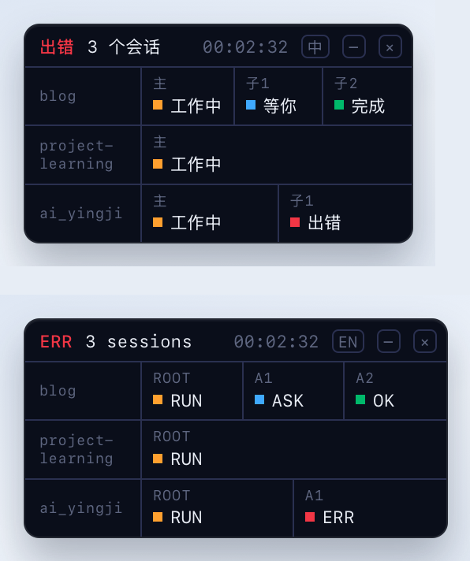

# xy-dsh-lamp

DeepSeek Harness 终端灯板。Host 会拉起一条 **系统级置顶窗**：浮在所有 App、所有工作台之上，不嵌在 DSH 窗口里。每个 Agent 一盏灯，全绿后收成 `完成  04/04`。根 Agent 结束时发系统通知。

macOS 用独立 HUD（`canJoinAllSpaces`）。DSH 退出后灯板会自己关掉。界面里不挂任何卡片。

下面这张是真实桌面截图。底下的 DSH 窗口被压暗，代表它被最小化、被别的应用盖住、或者切到了另一个桌面空间；灯板原本什么亮度就还是什么亮度，它留在最上层。


灯板会出现的状态按顺序走一遍：从待命开始，一个会话启动，子 Agent 出现，中间停下来等你确认一次、失败一次，最后全部完成收成一行；接着是多个项目并行、六个会话、收起成一个灯，以及中英切换。


## 语言

**默认中文。** 标题栏那个 `中` / `EN` 按钮切换语言，点一下立刻换。选择会写到 `~/.dsh/xy-dsh-lamp.json`，重启 DSH 后仍然生效（改 `index.mjs` 这类宿主代码需要重启 DSH 才会加载，只改页面不用）。

| 状态 | 中文 | English |
|---|---|---|
| 待命 | 待命 | IDLE |
| 工作中 | 工作中 | RUN |
| 等你 | 等你 | ASK |
| 出错 | 出错 | ERR |
| 完成 | 完成 | DONE（灯格里是 OK） |

Agent 代号在中文下也会跟着变：`ROOT` → `主`，`A1` / `A2` → `子1` / `子2`。这只是显示，宿主内部仍然用 `ROOT` / `A1`。

首次安装的默认语言由配置里的 `lang` 决定（见文末），一旦用按钮切过，按钮的选择优先。

同一块灯板，两种语言（上图中文、下图 English）：



## 移动

**整块灯板都能拖**（鼠标是抓手），标题栏右侧的 `中` / `EN` / `−` / `×` 按钮除外。位置会记住，重启 DSH 后回到原处；记下的位置如果落在已断开的显示器上，会自动退回左上角。

AppKit 自带的拖拽（`performDrag`、`isMovableByWindowBackground`）对「无边框 + 透明」窗口完全不生效——四种组合都实测过，一律直接返回。而这个 WKWebView 的 `window.screenX/screenY` 返回的是垃圾值（实测 `0` / 屏幕高度），页面也报不出屏幕坐标。所以拖动是这样做的：页面只负责在 `pointerdown / pointermove / pointerup` 时报「指针动了」，宿主用 `NSEvent.mouseLocation` 读真实光标位置，按增量搬窗口。

增量是逐次累加的，所以拖动中途窗口尺寸变化（agent 数量变了、或收起态展开）也不会错位。

「点击」还是「拖动」由宿主判定：整段手势位移小于 4pt 算点击。收起态的小灯被点击就展开，被拖动就只移位、不展开。

## 版面

窗口是**透明圆角窗**，尺寸跟着内容走：页面量出自己的自然尺寸后回报给 HUD，窗口按这个尺寸调整，左上角固定不动。

| 状态 | 尺寸（中文 / 英文） |
|---|---|
| 待命（无 Agent） | 188×65 / 213×65 |
| 1 个 Agent | 199×65 / 206×65 |
| 满 6 个 Agent | 344×65 / 338×65 |
| 2 个会话 | 233×107 |
| 3 个会话 | 222×146 |
| 全部完成 | 211×29 / 219×29（收成一行 `完成  02/02`） |
| 收起（1 个任务） | 30×30 |
| 收起（3 / 6 个任务） | 46×30 / 82×30 |

尺寸是 WKWebView 里实测的；中文字宽所以 6 灯时比英文略宽一点。

## 多个会话


**一个会话一行。** 并行开几个项目时，每个有主 Agent 在跑的会话各占一行，左列是项目名（取会话工作目录的最后一段），右边是该会话的灯。项目名太长会折行，鼠标悬停显示完整名字和会话标题。

表头在有多个会话时把 Agent 代号换成 `N 个会话`。最多画 6 行，多出来的在表头补 `+N`，不会静默吞掉。行序按紧急程度排：出错 → 等你 → 工作中 → 已完成。

表头那个时钟是**最早还在跑的那个 Agent 已经跑了多久**，不是某一个会话的用时。

> 早先的版本只挑「一个」主会话显示，于是你在 A 项目跑着、B 项目也跑着的时候，B 会整个不见——包括它下面的子 Agent。现在改成全部列出。

标题栏右侧的 `−` 把灯板**收起成一排小灯**：**一个任务一盏灯**，颜色就是那个任务自己的汇总状态。三个任务并行时就是三盏（可能同时是蓝、红、琥珀）。顺序跟展开时的行序一致：出错 → 等你 → 工作中 → 完成。

鼠标悬停显示 `状态 用时 · 各会话名字与标题`（多会话时全都列出来）。点这个小方块展开，拖它则只移位。收起状态会记住，重启后还是收起的。

`×` 是**退出灯板**。它要**点两次**：第一次变成红色的 `确认`，3 秒内再点一次才真退出。退出后要重启 DSH 才会回来，所以加了这道确认。

**右键**也出菜单：`回到左上角` / `退出灯板`。窗口正好只有卡片那么大，页面内的弹出层没地方画，所以菜单是宿主弹的原生菜单。

灯色（灯板与收起态一致）：

| 灯 | 状态 |
|---|---|
| 灰 | 待命 |
| 琥珀 | 工作中 |
| 蓝闪 | 等你（审批或提问卡在你这） |
| 红 | 出错 |
| 绿 | 完成 |

**等你用的是蓝色，不是琥珀**。这两个状态原来同色，只靠闪不闪区分，扫一眼分不出来 —— 现在同色系里也一眼能认。

一盏灯出错时，标题栏的 `工作中 / 等你` 会变成红色的 `出错`，但其余灯照常显示各自的进度。

## 等你

蓝灯闪表示**有东西卡在你这里**，两种情况：审批待处理，或者 `ask_user_question` 问出去了还没答。

不能用 `turn/end` 判断：审批期间 turn 是**开着的**（`approval.request()` 要求 turn 未结束），agent 状态一路都是 `running`，`turn/end` 根本不会来。只有 turn 已经结束、reason 是 `blocked` 时才走那条老路（实测在你自己的会话里从没出现过）。

`ask_user_question` 也接上了。它走的是 `user-questions/request` waterfall 钩子而不是审计事件，但那个待处理的 `tool/call`（名字正好是 `ask_user_question`）会落在 session 日志里，用 `callId` 和 `tool/result` 配对即可。其他工具调用不会误判成等待。

## 安装

属于 [xy-dsh](../) 集合。直接装：

```bash
dsh plugin --profile desktop add "github:Xinyuan-Gao/xy-dsh#path:xy-dsh-lamp"
dsh plugin --profile web add "github:Xinyuan-Gao/xy-dsh#path:xy-dsh-lamp"
```

要改代码就先 clone，再用 `link:` 装：

```bash
git clone https://github.com/Xinyuan-Gao/xy-dsh.git
cd xy-dsh
dsh plugin --profile desktop add link:"$PWD/xy-dsh-lamp"
```

然后重启 DSH Desktop，或重启 `dsh web`。

灯板是独立编译出来的 macOS HUD：首次加载时宿主用 `swiftc` 把 `hud.swift` 编到 `~/.dsh/xy-dsh-lamp-hud.app`，所以机器上要有 Xcode Command Line Tools。改了 `hud.swift` 之后重启 DSH，`compileHud` 会比较 mtime 自动重编。

## 配置

`~/.dsh/profiles/<profile>/cordis.patch.yml`：

```yaml
- id: xy-dsh-lamp
  name: xy-dsh-lamp
  config:
    enabled: true
    notify: true
    sound: true
    lang: zh      # zh | en，只决定首次安装的默认语言
    forgetMs: 600000   # 已完成会话在内存里保留多久（下限 180000）
```
