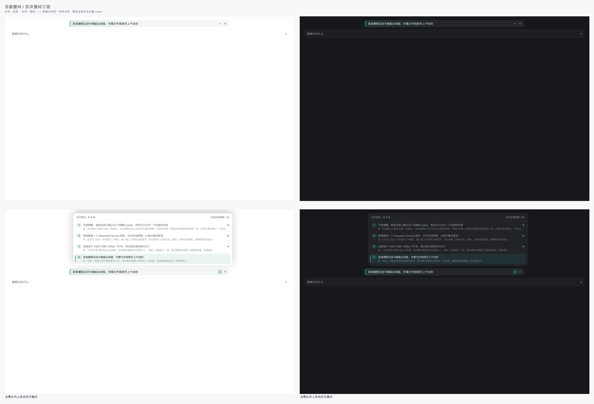
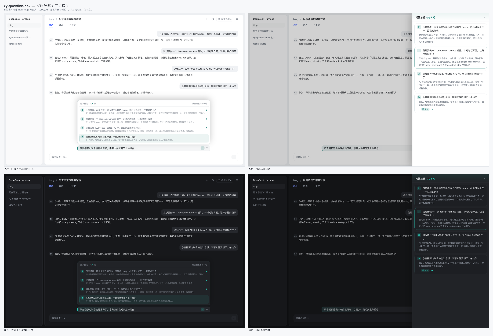

# xy-dsh-question-nav

> 让「我现在到底在问什么」永远看得见，并能一键把对话翻回之前任何一轮提问。

一个 **DeepSeek Harness（DSH）Web 客户端插件**。对话一长，长时间的思考过程会把你自己刚提的问题顶出视野；这个插件在输入框上方常驻**当前提问**，并提供一份**按时间排列的历次提问**，点其中任何一条就把对话视图回退到那一轮。

这个目录是 [xy-dsh](https://github.com/Xinyuan-Gao/xy-dsh) 集合仓库的一个插件子目录 —— 装法见下面「安装」。

[](docs/screenshots/strip.png)



---

## 功能

| 位置 | 行为 |
| --- | --- |
| 输入框上方一行 | 常驻显示**当前提问**。默认单行截断，点文字展开到 4 行看全文。 |
| 该行右侧 `⌄` | 向上拉出**历次提问**面板：序号 + 提问摘要 + 回答摘要，按时间顺序排列。点任意一条 → **对话视图回退到那一轮**。 |
| 该行右侧 `☰` / 页头「问答总览 n」 | 打开右侧抽屉：每一轮的提问全文 + 回答全文，点卡片展开全文，展开后可点箭头跳转。 |
| 滚动 / Esc / 点面板外 | 面板收起；滚动时当前所在的一轮会被标记。 |

**关于「回退」**：它只移动对话视口 —— 滚回那一轮的提问位置。**不会**回滚代码、文件、git 状态或会话内容。被折叠进「过程」分组的提问会先自动展开；尚未加载进窗口的历史会先分页拉取再落位。

数据全部来自运行时的会话快照：把 Chat 节点按轮次聚合，`user` / `steering` 节点作为提问，其后同一轮内最后一个 `assistant-step` 的文本块作为回答（推理块不进入摘要）。

## 挂载的槽位

| 槽位 | 内容 |
| --- | --- |
| `conversation.input.dock`（`order: -100`） | 当前提问条 + 历次提问下拉 |
| `conversation.session.header.utilities`（`order: 20`） | 「问答总览 n」按钮 |
| `shell.overlay`（`order: 40`） | 右侧问答总览抽屉 |

三个槽位都是 additive 的：不会替换任何出厂 UI。插件依赖会话级 `useChat` hook 读取 Chat store，依赖宿主行标记 `data-chat-anchor-key` / `data-chat-turn` 与滚动容器 `data-conversation-scroll` 做定位。

## 配色

插件通过主题服务注册了**自己的强调色层**，而不是把颜色硬编码进样式表：

```js
theme.overrideTokens('xy-dsh-question-nav/accent', {
  '--dshq-accent': { light: '#0F766E', dark: '#2DD4BF' },
  '--dshq-accent-soft': { light: '#E4F4F1', dark: '#10312E' },
})
```

所有彩色元素都由这一个 token 派生（`color-mix()` 调透明度与混合），因此亮/暗主题自动跟随，卸载插件时整层颜色一并消失。选青绿是为了与 DSH 自身的蓝色选中态形成对比，避免两个控件抢同一个视觉语义。

改配色只需要动 `lib/client.js` 里的 `ACCENT` / `ACCENT_SOFT` 两个值（工厂里紧挨注释 `tokens` 的那两行）。

## 安装

包结构遵循 DSH 客户端插件约定：`package.json` 的 `dsh.client` 声明注入依赖与平台；浏览器入口是 `lib/client.js`（以 `window.__ModuleLoader__` 工厂注册，无构建步骤），宿主入口是 `index.mjs`。

本插件是 [xy-dsh](https://github.com/Xinyuan-Gao/xy-dsh) 集合仓库的一个子目录，安装时用 pnpm 的 `#path:` 片段指定目录：

```bash
dsh plugin --profile web add "github:Xinyuan-Gao/xy-dsh#path:xy-dsh-question-nav"
```

装完重启 DSH Desktop，或重启 `dsh web`。要更新就重跑同一条命令。

想改代码就 clone 下来、用 `link:` 装一份可编辑的：

```bash
git clone https://github.com/Xinyuan-Gao/xy-dsh.git
cd xy-dsh
dsh plugin --profile web add link:"$PWD/xy-dsh-question-nav"
```

`dsh.client.inject` 已经声明了它需要的运行时依赖：`@deepseek-ai/dsh-client-ui-renderer`、`@deepseek-ai/dsh-client-ui-conversation`、`@deepseek-ai/dsh-client-ui-session`、`@deepseek-ai/dsh-client-ui-chat`、`@deepseek-ai/dsh-client-ui-theme`。

## 验证它活着

装好后刷新页面，看两点：

- 输入框上方是否出现当前提问那一行；
- 页头是否出现「问答总览 **n**」按钮 —— **数字出现就说明提问数据已经抓到**（拿不到会话数据时按钮只有文字，不会有数字）。

## 开发

预览页与截图不是手写的，而是从插件源码里读取真实样式表后渲染的 —— 所以预览不会和实现漂移：

```bash
node tools/build-previews.mjs        # 生成 docs/previews/*.html（读 lib/client.js 的 CSS）
python3 tools/compose-sheets.py      # 合成 docs/screenshots/*.png
```

重新截图（需要本机 Chrome）：

```bash
CHROME="/Applications/Google Chrome.app/Contents/MacOS/Google Chrome"
"$CHROME" --headless --hide-scrollbars --force-device-scale-factor=2 \
  --window-size=1380,880 --screenshot=docs/screenshots/light-strip.png \
  "file://$PWD/docs/previews/light-strip.html"
```

> 截图说明：`docs/screenshots/*.png` 是用上述方式、**按插件真实样式表 + DSH 主题 token 值**渲染的预览图；其中宿主外壳（左侧栏、页头、消息区）是示意性的，不属于本插件。

### 踩过的坑（给后来的插件作者）

这个插件最初是作为 DSH 的动态 Cordis 包迭代出来的，有三处不是「看起来像 bug」而是真的会让包加载失败的坑：

1. **`ctx` 是白名单代理**：返回裸函数形式的插件没有 `inject` 声明位，读 `ctx.slots` 会被守卫以 *service "slots" is not declared* 拒绝 —— 必须返回 `{ name, inject: ['slots'], apply }`；
2. **`apply` 不能有返回值**：Cordis 把 effect 会执行 `apply` 的返回值，非函数、非 Promise、非迭代器的返回值（例如习惯性写 `return {}`）会被判为 `Invalid effect` 直接加载失败；
3. **外部槽位拿不到会话数据时不要硬读**：跨会话共享的数据要先在会话槽位里发布、根作用域槽位再消费，并且读取处要容忍空值，否则会在挂载瞬间抛渲染错误。

## 兼容性

- DSH Web（浏览器端插件，`platform: "web"`）。
- 依赖会话级 `useChat` hook；若某个槽位不注入它，插件会安静地不渲染提问条，而不是崩溃。

## License

MIT
